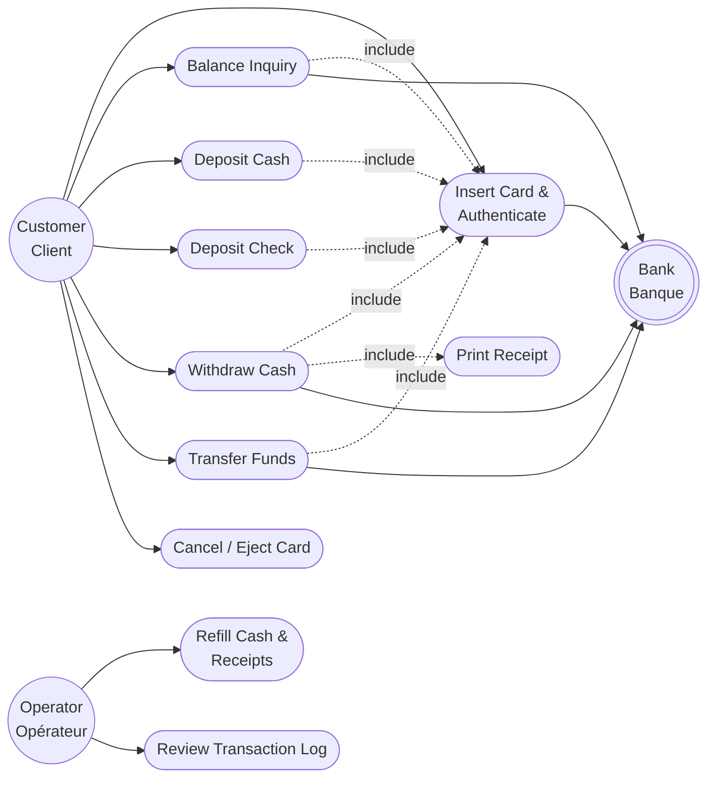
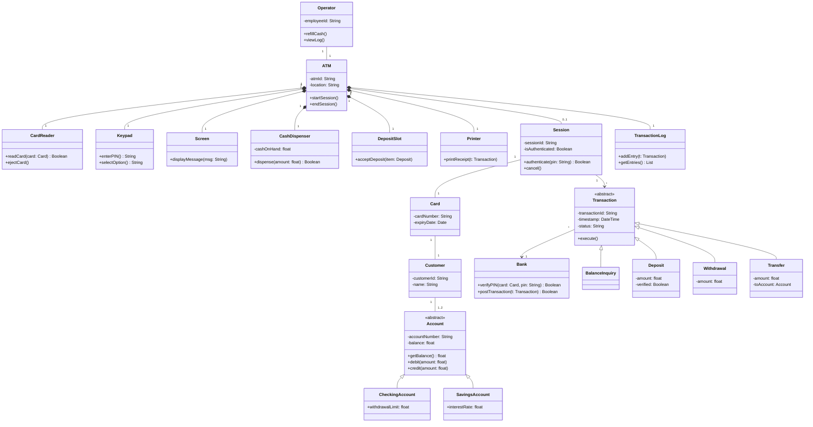
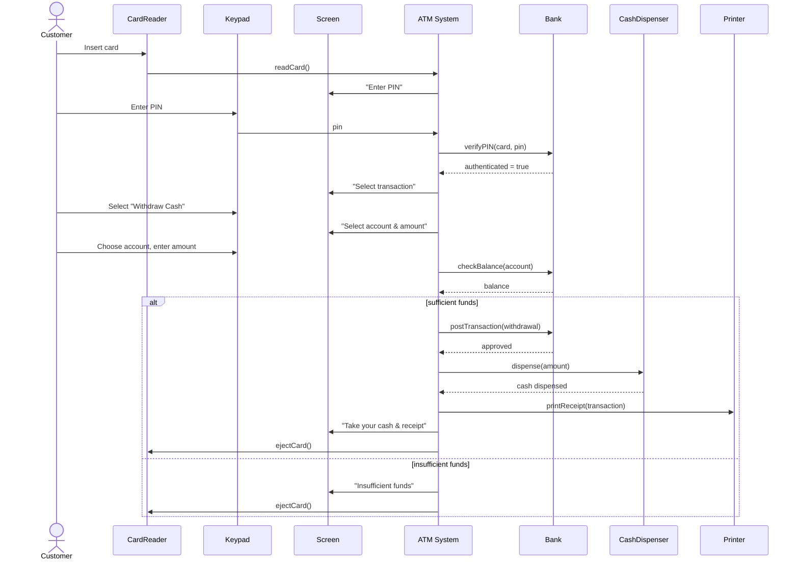

# Conception UML — ATM System

Diagrammes de conception du système : cas d'utilisation, classes, et séquence pour le retrait d'espèces.
*(Design diagrams for the system: use case, class, and a sequence diagram for cash withdrawal.)*

> Note : les fonctionnalités de sécurité ajoutées au projet (hachage du PIN, OTP) ne figurent pas encore dans ces diagrammes de conception initiaux — à mettre à jour au fur et à mesure de l'implémentation.

---

## 1. Use Case Diagram / Diagramme de cas d'utilisation

**Actors (Acteurs):** Customer/Client, Bank (external system/système externe), Operator/Opérateur.

**Notes (EN):** Every money-related use case *includes* "Insert Card & Authenticate" (no transaction without a valid PIN). The ATM talks to the Bank system to authenticate and to post transactions. The Operator has separate use cases (refilling, checking the log) — they don't perform customer transactions.

**Notes (FR) :** Chaque cas d'utilisation lié à l'argent *inclut* « Insérer la carte et s'authentifier » (aucune transaction sans PIN valide). Le GAB communique avec le système bancaire pour authentifier et enregistrer les transactions. L'opérateur a des cas d'utilisation séparés (réapprovisionnement, consultation du journal) — il n'effectue pas les transactions du client.

---

## 2. Class Diagram / Diagramme de classes

**Notes (EN):** `Account` and `Transaction` are abstract base classes — this keeps the design open for new account or transaction types later without changing existing code. A `Customer` can own 1–2 accounts (Checking, Savings).

**Notes (FR) :** `Account` et `Transaction` sont des classes abstraites — cela permet d'ajouter facilement de nouveaux types de comptes ou de transactions plus tard sans modifier le code existant. Un `Customer` peut posséder 1 à 2 comptes (Courant, Épargne).

---

## 3. Sequence Diagram — Withdraw Cash / Retrait d'argent

**Notes (EN):** This is the "happy path" plus the one alternate branch (insufficient funds). Note the bank is consulted twice: once to authenticate, once to authorize the actual debit — this matches the requirement that "without authentication, the user cannot perform any transaction."

**Notes (FR) :** Ceci est le scénario nominal, plus la branche alternative (fonds insuffisants). La banque est consultée deux fois : une fois pour authentifier, une fois pour autoriser le débit réel — conformément à l'exigence selon laquelle « sans authentification, l'utilisateur ne peut effectuer aucune transaction ».
